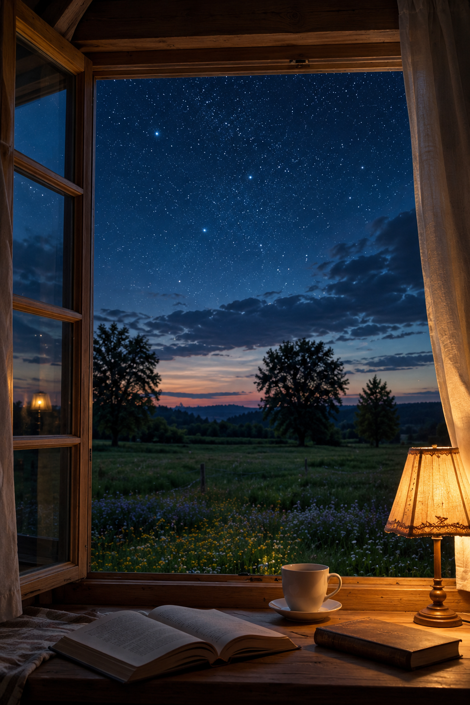

# Nighttime Window Cinemagraph

A script-based pipeline that turns the single still photograph in
[`assets/source.png`](assets/source.png) into a subtle, photorealistic-looking
animation — a **cinemagraph**. Nothing in the scene is invented or replaced;
the composition, architecture, window, furniture, book, cup, lamp, landscape
and lighting are all preserved. Only gentle, physically-plausible motion is
layered on, frame by frame, and the frames are stitched into an MP4 with
ffmpeg.



## What moves

| Effect | Where | How |
| --- | --- | --- |
| Cinematic push-in | whole frame | extremely slow zoom (1.0 → 1.045) toward the open window |
| Star twinkle | upper night sky | bright star pixels modulated by a few overlaid slow sinusoids, each with a unique phase |
| Cloud drift | low sky / horizon | slow one-way horizontal travel plus a faint sway, feathered to the cloud band |
| Grass & wildflower sway | meadow | horizontal breeze whose amplitude grows toward the foreground |
| Curtain billow | sheer curtains, both sides | gentle low-frequency horizontal displacement in slight counter-phase |
| Lamp flicker | warm lamp glow | small irregular brightness quiver, biased to the warm channels |
| Rising steam | above the teacup | scrolling fractal value-noise wisps, narrow at the rim and fading upward |

Every effect is driven by smooth periodic (or slowly ramping) functions, so the
motion is continuous and seamless-looking. No new objects, no people, no
morphing or warping.

## How it works

`scripts/cinemagraph.py` is a self-contained renderer:

1. The source image is loaded once as a float array.
2. Feathered masks (sky, clouds, meadow, curtains, lamp, steam) are built in
   normalized coordinates, so the layout is resolution-independent.
3. For each frame, a **geometric displacement field** (push-in zoom + cloud,
   grass and curtain motion) is applied by bilinearly resampling the source,
   then **photometric modulation** (star twinkle, lamp flicker) and the
   additive steam overlay are composited on top.
4. Frames are streamed straight to `ffmpeg` over stdin (rawvideo), so no
   intermediate PNGs touch the disk, and encoded to H.264.

Only `numpy` and `Pillow` are needed for rendering; a bundled static ffmpeg
(`imageio-ffmpeg`) is used automatically if a system `ffmpeg` is not on `PATH`.

## Usage

```bash
pip install numpy pillow imageio-ffmpeg

python3 scripts/cinemagraph.py \
    --input assets/source.png \
    --output out/night_window.mp4 \
    --seconds 8 --fps 24 --crf 17
```

Key options:

- `--seconds` / `--fps` — clip length and frame rate.
- `--crf` — x264 quality (lower is better; 17 is visually lossless-ish).
- `--seed` — reproducible randomness for star phases and steam noise.

All effect strengths and region boundaries are constants at the top of the
script and are easy to tune — for example, lower `PUSH_MAX_SCALE` for an even
stiller camera, or raise `STEAM_OPACITY` for a stronger plume.

## Notes & limitations

This is a **cinemagraph**, produced entirely with deterministic image
processing — it does not use a generative AI video model, so it does not
hallucinate new detail (e.g. it cannot reveal what is *behind* an object as the
camera pushes in). The trade-off is that the original scene is preserved
exactly and every motion is controllable and repeatable.
